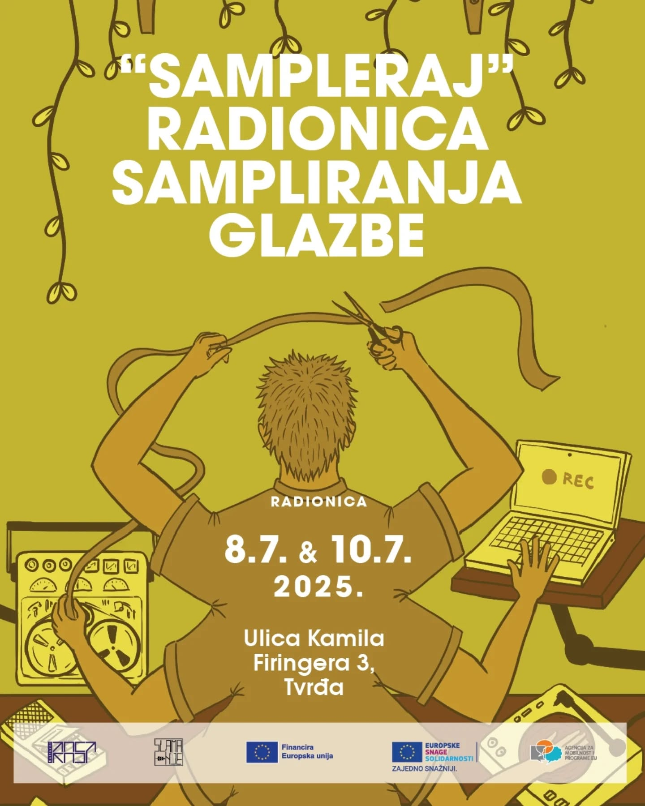
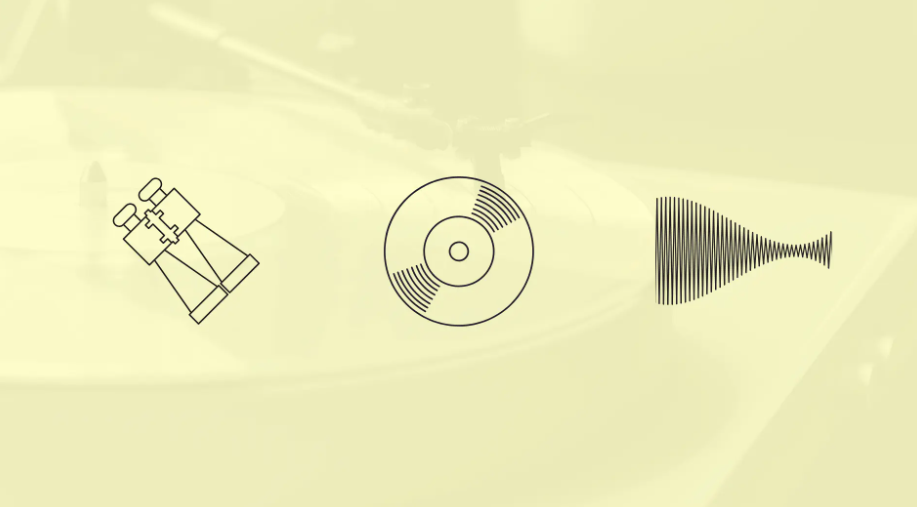
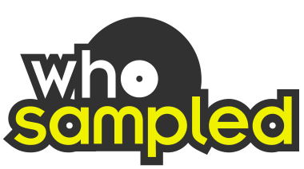
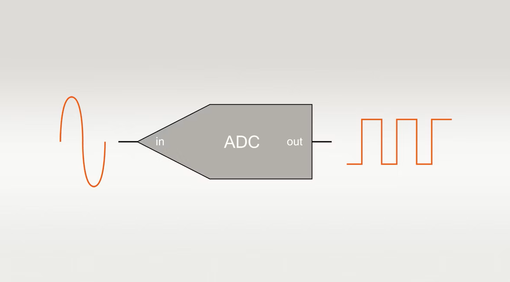
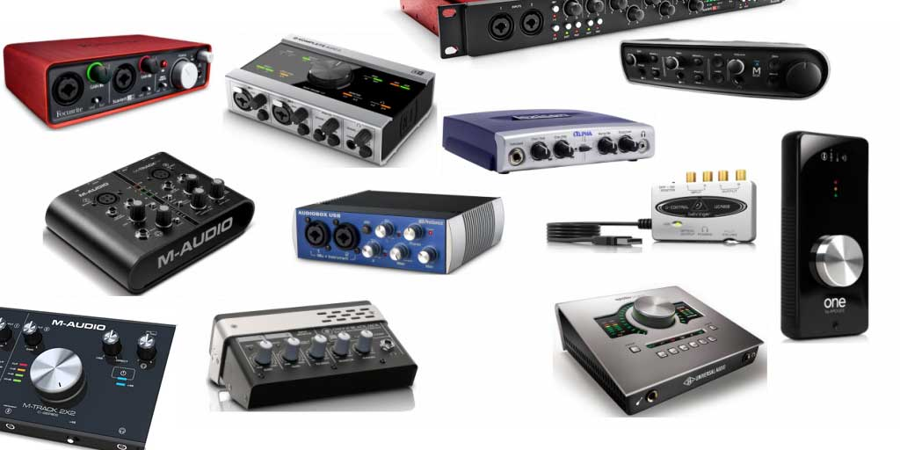

# 🎛️ sempleraj

**Radionica sempliranja glazbe – Osijek, 2025.**

📌 **Brzi pregled resursa** nalazi se na dnu ovog dokumenta.

---

## 👋 Dobrodošli!

Bok svima! Zapišite/bookmarkajte si link do ove stranice:

🔗 [github.com/rsoric/sempleraj](https://github.com/rsoric/sempleraj)
🔗 [tinyurl.com/2a2ryedu](https://tinyurl.com/2a2ryedu)

---

## 📅 Što ćemo raditi prvi dan (Utorak 8.7.2025.)

### 🔹 Uvod, ukratko i zanimljivo:

* Što je **sample**
* Primjeri iz glazbe
* Što **sampliranje omogućuje**?
* Što je **DAC (Digital-to-Analog Converter)**?

### 🔹 Snimanje sample-ova:

* Snimanje s **ploča**
* Snimanje vlastitih **zvukova**
* Snimanje **kazeta**

*Drugi dan ćemo koristiti snimljene sample-ove da napravimo vlastite stvari! Danas stvaramo sirovine s kojima ćemo raditi.*

---

## 📖 Što je sample?

> **Definicija na Engleskom:**
> *In sound and music, sampling is the reuse of a portion (or sample) of a sound recording in another recording. Samples may comprise elements such as rhythm, melody, speech, or sound effects.*

### 🎧 Izvori za sample mogu biti bilo što:

| Vrsta                     | Primjeri                  |
| ------------------------- | ------------------------- |
| 🥁 Bubnjevi                | Drum loop, jedan udarac   |
| 🎤 Vokali                  | Komadić vokalne linije    |
| 🌆 Ambijentalni zvukovi    | Grad, priroda, kuća       |
| 📻 Radio, TV, kazete       | Slučajni ulomci           |
| 🎶 Cijeli dio druge pjesme | Melodije, beatovi, vokali |
| 🔬 Eksperimentalni zvukovi | Šumovi, glitch, DIY       |

---

## 🎼 Primjeri samplova u popularnoj glazbi

| Umjetnik                         | Pjesma                                                                      | Sample iz                                                                      | Vrsta sample-a                                                                       |
| -------------------------------- | --------------------------------------------------------------------------- | ------------------------------------------------------------------------------ | ------------------------------------------------------------------------------------ |
| M.I.A.                           | [Paper Planes](https://www.youtube.com/watch?v=ewRjZoRtu0Y)                 | [The Clash – Straight to Hell](https://www.youtube.com/watch?v=t7SvtikTkrM)    | 🎸 Melodični loop                                                                     |
| Kanye West                       | [Blood On The Leaves](https://www.youtube.com/watch?v=KEA0btSNkpw)          | [Nina Simone – Strange Fruit](https://www.youtube.com/watch?v=BnuEMdUUrZQ)     | 🎤 Vokal                                                                              |
| N.W.A.                           | [Straight Outta Compton](https://www.youtube.com/watch?v=TMZi25Pq3T8)       | [The Winstons – Amen Brother](https://www.youtube.com/watch?v=GxZuq57_bYM)     | 🥁 Bubanj (Amen Break) → [bitan dio](https://www.youtube.com/watch?v=rvCZ-HmXtCc) |
| Fred again.. ft. Blessed Madonna | [Marea](https://www.youtube.com/watch?v=l4UkYBr1NnA)                        | [Zoom poziv](https://www.youtube.com/watch?v=t4EE5dGrVJU)                      | 🗣️ Govor                                                                              |
| Gotye                            | [Somebody That I Used To Know](https://www.youtube.com/watch?v=8UVNT4wvIGY) | [Razni izvori](https://www.whosampled.com/Gotye/Somebody-That-I-Used-to-Know/) | 🎛️ Sve je sample!                                                                     |

🧠 **WhoSampled** – odlična stranica gdje možete istražiti koje pjesme koriste koje sampleove:
🌐 [https://whosampled.com](https://whosampled.com)

---

## 🧩 Što čini dobar sample?

* 🎯 Čisti dijelovi pjesme (gdje se čuje samo jedan instrument)
* 🎲 Nasumični ili neobični zvukovi
* 🧪 Eksperimentalna glazba i neobični izvori
* 💬 Snimljeni dijalozi, ambijenti

---

## 🎨 Što omogućuje sampliranje?

* 🎶 Stvaranje potpuno nove pjesme iz starih dijelova
* 🔀 Kombinacija s drugim elementima – živi, organski osjećaj
* 🕰️ Reinterpretacija stare glazbe u modernom kontekstu

---

## 🔧 Kako samplirati?

* Zvuk iz svijeta je **analogan** → treba ga **pretvoriti u digitalni** kako bi s njim radili u programu za izradu glazbe
* Potrebna oprema:

  * 🎙️ Mikrofon ili drugi izvor zvuka (npr. gramofon)
  * 💻 Računalo s **ADC** (Analog-to-Digital Converter)
  * 🎛️ **Audio Interface** (za bolju kvalitetu)

---

## 🎤 Snimanje sample-ova – danas na radionici

Koristimo **besplatan softver**: [Ocenaudio](https://www.ocenaudio.com/)
🖥️ Već je instaliran na računalima.

---

## 👥 Organizacija snimanja

### Skupina 1: Snimanje s ploča

* 🎵 **Gramofon:** Audio Technica AT-LP60
* 💻 Snimanje preko USB izlaza u **Ocenaudio**
* ✂️ Izdvajanje zanimljivih dijelova za korištenje

### Skupina 2: Snimanje ambijenta i predmeta

* 🏠 U drugoj prostoriji
* 🎙️ Mikrofon već spojen
* 🎲 Koristimo razne predmete i prostore za stvaranje zvukova

### 🎁 Bonus: Snimanje s kazeta

* 📼 Kazetofon → 🎛️ ADC → 💻 **Ocenaudio**
* Za one koji se žele odvažiti!

---

## 🔄 Sync & organizacija

Sve što snimimo danas bit će automatski sinkronizirano u zajednički Google Drive folder.

📁 [Link](https://drive.google.com/drive/folders/1eFBlL7ELi-er3B4FCKvyltNHiDU1W1YU?usp=sharing)

---

## 📚 Brzi pregled resursa

| Resurs              | Link                                                                                         |
| ------------------- | -------------------------------------------------------------------------------------------- |
| Ocenaudio           | [ocenaudio.com](https://www.ocenaudio.com/)                                                  |
| WhoSampled          | [whosampled.com](https://whosampled.com)                                                     |
| Google Drive folder | [Link](https://drive.google.com/drive/folders/1eFBlL7ELi-er3B4FCKvyltNHiDU1W1YU?usp=sharing) |

